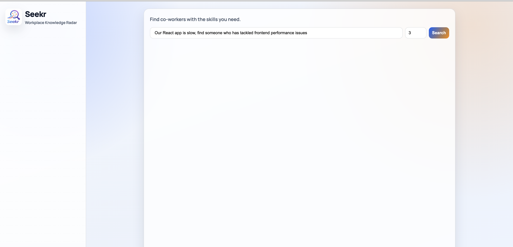
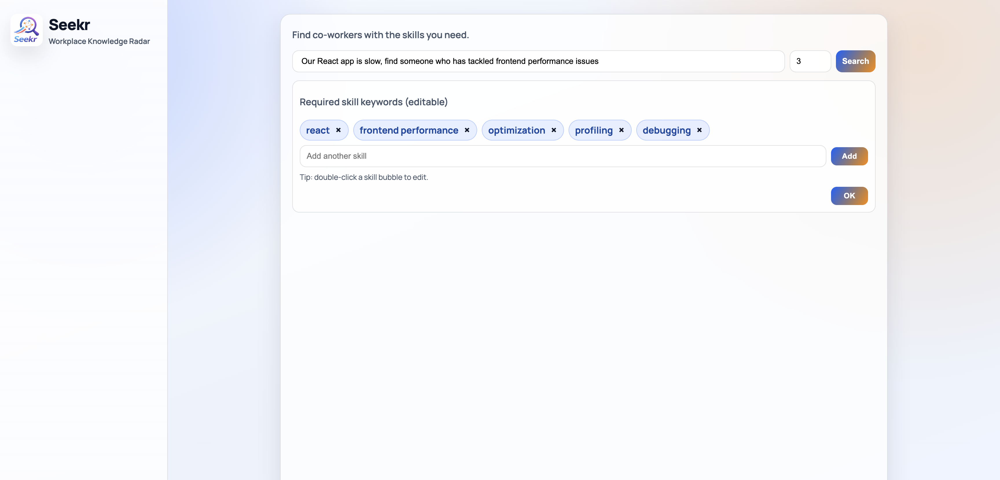
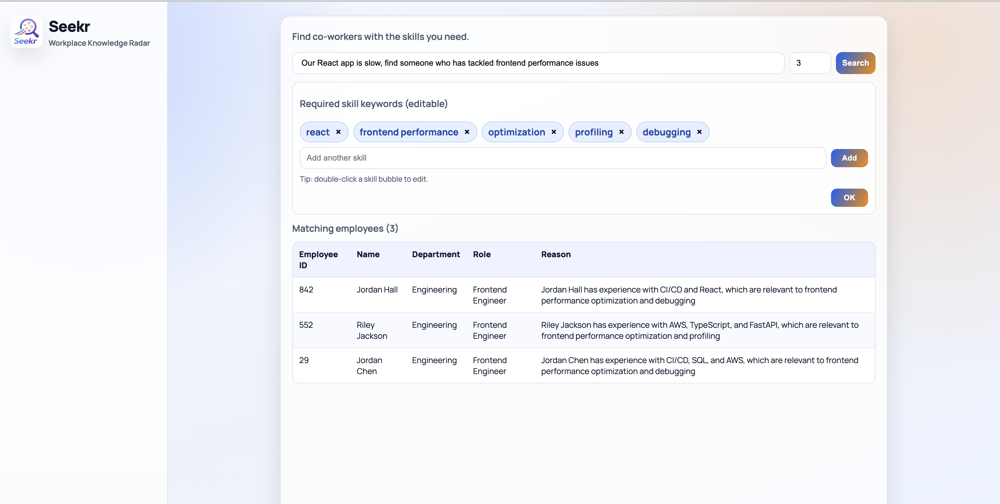

# Seekr — Workplace Knowledge Radar

Seekr helps you find the right co-worker for the job. Describe what you need in plain English and the app uses Claude AI to rank the best-matching employees from your organisation, with a short explanation for each match.

---

## Screenshots

**① Enter a search query**



**② Review and edit extracted skills**



**③ Browse AI-ranked results**



---

## How it works

```
User query
    │
    ▼
① Extract required skills (Claude)
    │  "Find a backend engineer with FastAPI and SQL"
    │  → ["fastapi", "sql", "python", "backend"]
    │
    ▼
② User reviews & edits extracted skills
    │  (add / remove / rename skill chips in the UI)
    │
    ▼
③ Keyword shortlist  (fast in-memory scoring)
    │  Top 20 candidates from 1 000-employee CSV
    │
    ▼
④ AI ranking (Claude)
    │  Returns top 3–5 employees, each with a one-line reason
    │
    ▼
Ranked results table
```

---

## Tech stack

| Layer | Technology |
|---|---|
| **AI** | [Anthropic Claude](https://www.anthropic.com/) (`claude-3-5-haiku-latest`) |
| **Backend** | Python 3.11+, FastAPI, Uvicorn |
| **Data validation** | Pydantic v2 |
| **HTTP client** | httpx (async) |
| **Frontend** | React 18, Vite |
| **Data source** | CSV file (1 000 employee records) |

---

## Project structure

```
.
├── data/
│   └── employees.csv          # 1 000-row employee dataset
├── docs/
│   └── screenshots/           # README demo screenshots
├── backend/
│   ├── app/
│   │   ├── main.py            # FastAPI app & route handlers
│   │   ├── models.py          # Pydantic request/response models
│   │   ├── ai_service.py      # Claude API integration
│   │   ├── search.py          # Keyword scoring & shortlist logic
│   │   └── data_loader.py     # CSV parsing
│   ├── requirements.txt
│   └── .env.example
└── frontend/
    └── src/
        ├── App.jsx            # Main UI component
        └── api.js             # API client functions
```

---

## Getting started

### Prerequisites

- Python 3.11+
- Node.js 18+
- An [Anthropic API key](https://console.anthropic.com/)

### 1. Backend

```bash
cd backend
python3 -m venv .venv
source .venv/bin/activate        # Windows: .venv\Scripts\activate
pip install -r requirements.txt
cp .env.example .env
```

Open `.env` and set your API key:

```env
ANTHROPIC_KEY=sk-ant-...
```

Start the server:

```bash
uvicorn app.main:app --reload --port 8000
```

The API will be available at `http://localhost:8000`.

#### Optional environment variables

| Variable | Default | Description |
|---|---|---|
| `ANTHROPIC_KEY` | — | **Required.** Your Anthropic API key. |
| `ANTHROPIC_MODEL` | `claude-3-5-haiku-latest` | Claude model to use. |
| `EMPLOYEE_CSV_PATH` | `../data/employees.csv` | Path to the employee data file. |

### 2. Frontend

```bash
cd frontend
npm install
npm run dev
```

Open `http://localhost:5173` in your browser.

#### Optional environment variables

| Variable | Default | Description |
|---|---|---|
| `VITE_API_BASE_URL` | `http://localhost:8000` | Backend URL. |

---

## API reference

### `POST /search/manual`

Keyword and department filter with ranked results.

**Request**
```json
{
  "keyword": "machine learning",
  "department": "Engineering"
}
```

**Response**
```json
{
  "results": [
    {
      "employee_id": 42,
      "name": "Jane Smith",
      "department": "Engineering",
      "role": "ML Engineer",
      "skills": ["python", "tensorflow", "mlops"],
      "projects": ["recommendation engine"],
      "bio": "..."
    }
  ]
}
```

---

### `POST /search/ai/skills`

Extract required skill keywords from a natural-language query using Claude.

**Request**
```json
{ "query": "I need a backend engineer who knows FastAPI and PostgreSQL" }
```

**Response**
```json
{ "required_skills": ["fastapi", "postgresql", "python", "backend", "rest api"] }
```

---

### `POST /search/ai`

Rank the best-matching employees for a query using Claude, with a short explanation per result.

**Request**
```json
{
  "query": "backend engineer with FastAPI and SQL",
  "top_n": 3,
  "required_skills": ["fastapi", "sql", "python"]
}
```

**Response**
```json
{
  "results": [
    {
      "employee": { "employee_id": 7, "name": "Alex Ray", ... },
      "reason": "Led three FastAPI microservices with PostgreSQL; strong SQL background across two data-heavy projects."
    }
  ]
}
```

`top_n` must be between **3** and **5**.

---

## Employee data format

The CSV must include the following columns. Multi-value fields (`skills`, `projects`) accept comma- or semicolon-separated values.

| Column | Type | Example |
|---|---|---|
| `employee_id` | integer | `101` |
| `name` | string | `Jane Smith` |
| `department` | string | `Engineering` |
| `role` | string | `Backend Engineer` |
| `skills` | multi-value | `python, fastapi, sql` |
| `projects` | multi-value | `payments API; data pipeline` |
| `bio` | string | Free-text description |

---

## License

MIT
